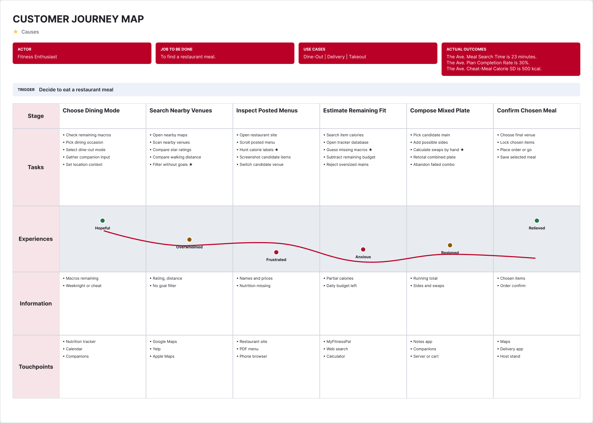
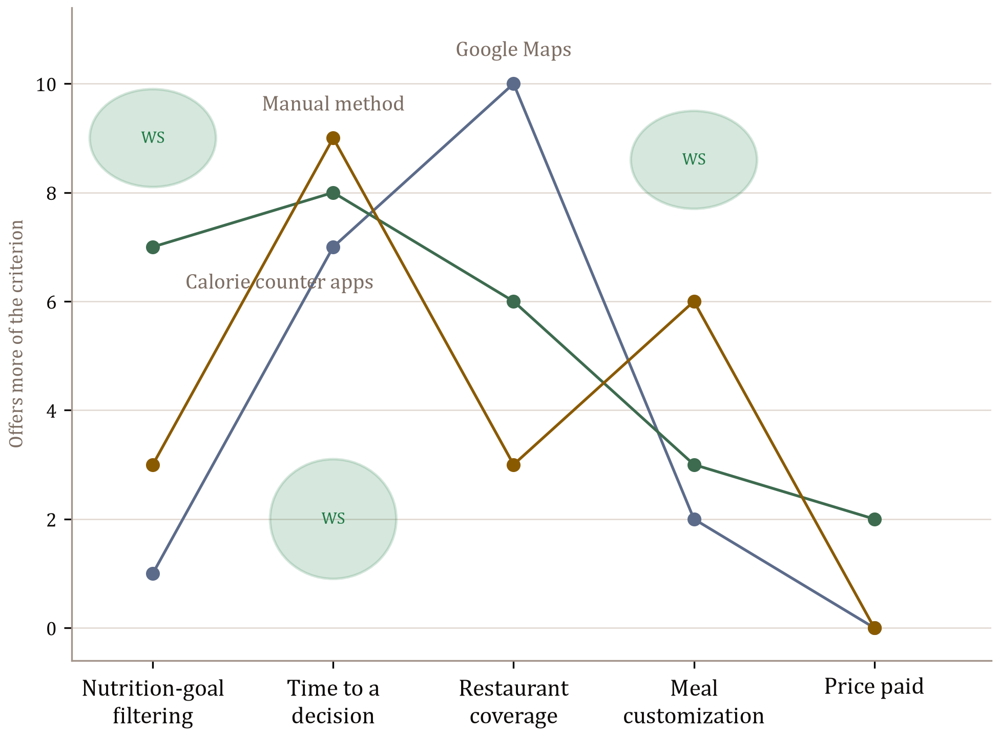
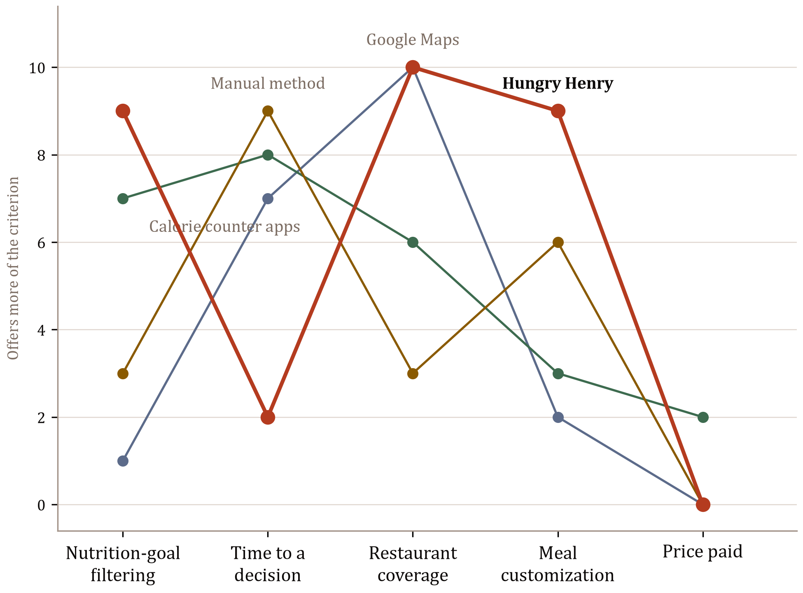
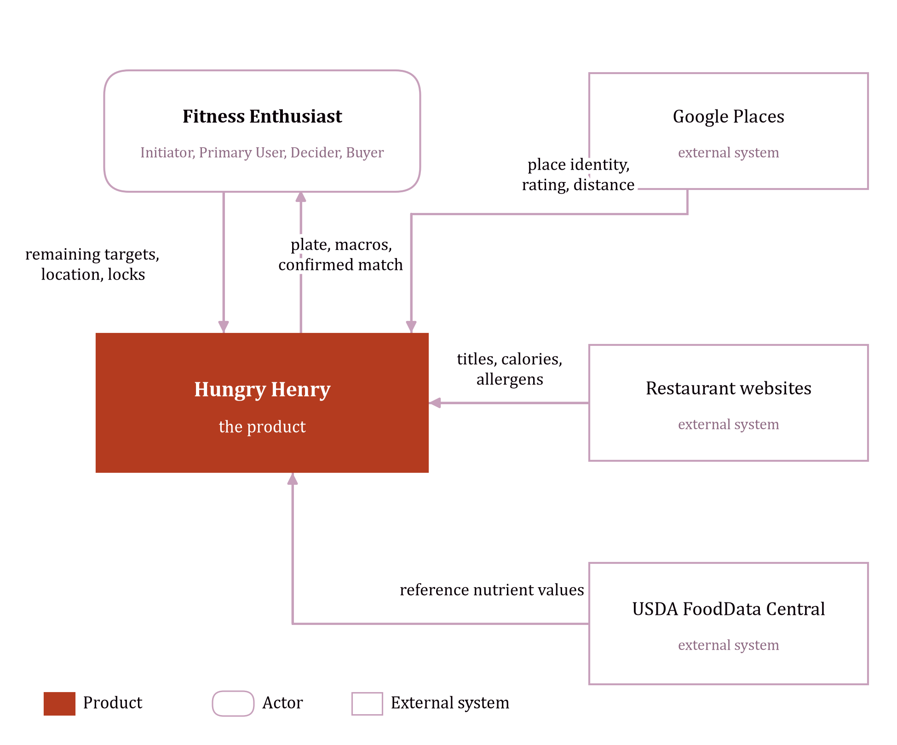

# Product Idea Workbook
By Alex Voller

## Product Idea Brief

The purpose of this brief is to propose Hungry Henry, a restaurant and meal discovery product which aims to solve sustainable eating challenges by providing nutritionally compliant restaurant meal options. Secondly, this brief will outline the problem, how Hungry Henry is different from the way a meal is found today, the market value, and the price. 

What that person needs to do is find a restaurant meal. That search takes 23 minutes today, and it should take 3. A weekly plan is finished 30 percent of the time, and it should be finished 75 percent of the time. A cheat meal scatters 500 kcal around the calories still left, and it should scatter 150 kcal. Restaurants post names and prices, not a nutrition record. Google Maps and the other tools nearby rank on rating, distance, cuisine, and price, not on a personal target. A main, a side, and a swap are done by hand. On 72 restaurant meals a year, 55 percent blow the plan or go untracked: 39.6 such meals per person per year, and 3.2 billion such meals a year among the 81 million people who belong to a fitness facility.[1][2][13]

Hungry Henry is an iPhone app, with no physical product. It curates meals and courses from restaurants nearby that meet, or come close to, the nutrition still left that day. The plate shows the restaurantn be locked, the rest of the plate can move, and the meal can be confirmed and shared. A sentence to Ask Henry becomes a plate. This happens before the order, which is how the hunt becomes a meal chosen to fit. The first version is the sit-down meal, for the person who already logs macros closely, because that is where a posted menu does the most damage., the rating, the distance, the foods, and a hit or a plus-or-minus on energy, protein, carbohydrates, and fat. 

The market is those 81 million people, and membership grew 5.2 percent from 2024 to 2025.[2] If every one of them bought the paid membership once a year at $14.40, the total addressable market would be $1,166,400,000 and 81 million memberships. That assumes everyone buys. It is the size of the opportunity, not a forecast, and it excludes restaurant fees. Those fees are the primary revenue of the business, from restaurants paying to have meals seen, and they are not analyzed here. People find a place today with Google Maps, which covers the restaurants and does not choose the meal, and the search still takes 23 minutes. Hungry Henry is the option that curates the meal to the target and reaches a decision in about 3 minutes.

The meal is free to find. Free includes unlimited swipes, a range on calories and a range on protein, and Ask Henry up to a rate limit. The price is $0 because that is enough to tell Henry a goal and start matching, and a fee should not sit on the job. Paid is $14.40 per person per year, charged once a year at the start to that person, by card or the app store. It widens the filters to fat, carbohydrates, and micronutrients, with is, less, and more. It recommends plates curated from meals already liked, and one Hungry Henry Match is gifted; that plate may include a discount at a participating restaurant. Ask Henry is unlimited, where Free stops at the rate limit.

The benefit against today's search is 20 minutes saved on each restaurant meal, 24 hours a year, worth $480 at $20 an hour (`assumption:`). The cheat meal sits closer to the calorie target, and the week's plan is more likely to be finished. The paid recommendations are the extra: a plate drawn from meals already liked, a possible discount on that restaurant bill, and the time not spent rebuilding a menu. First-year costs that can be stated in money are the $14.40 and $3.33 to set the stricter filters once. $480 against $17.73 is about 27.1 to 1. The decision takes minutes and ends if it is not renewed, which is compelling at about 3 to 1. At 27.1 to 1 the paid plan is compelling for the person who wants those recommendations and unlimited Ask Henry. Anyone else stays on Free.

## 1. Customer Problem Space

### 1. Fertile Land

Restaurants

### 2. Actor

**Fitness Enthusiast**

A Fitness Enthusiast is a person actively pursuing a fitness or nutrition plan who still wants to eat restaurant meals, and who is at risk of abandoning that plan when menus do not show how a meal fits their targets.

The Fitness Enthusiast is Initiator, Primary User, Decider, and Buyer of the consumer product. A second customer concept — the Restaurant Operator — is Buyer of the B2B listing tiers, and is not developed as the course Actor.

### 3. Job To Be Done

To find a restaurant meal.

<!-- landscape -->

### 4. Outcomes

| Outcome idea | Metric | Actual Outcome | Desired Outcome | Measurement Method |
| --- | --- | --- | --- | --- |
| Faster meal find | Ave. Meal Search Time | The Ave. Meal Search Time is 23 minutes. | The Ave. Meal Search Time will be 3 minutes. | **Calculate:** minutes from the trigger (decide to eat a restaurant meal) to a confirmed item selection, averaged across occasions. Actual = 14 minutes selecting a restaurant + 9 minutes deciding what to order once seated.[1] Units: minutes per occasion. |
| Broken mundane nutrition cycle | Ave. Plan Completion Rate | The Ave. Plan Completion Rate is 30%. | The Ave. Plan Completion Rate will be 75%. | **Calculate:** `(weekly cycles finished ÷ weekly cycles started) × 100`. A cycle is finished if the Actor logs through the week's last planned day without abandoning the plan. Units: percent. *(assumption: actual 30% is informed by Helander et al. 2020 — new January dieters persist about 3.1–5.3 weeks, so most intended weekly cycles in a longer plan are not finished;[6] desired 75% is 45 percentage points above that DIY baseline.)* |
| Less next-day guilt | Ave. Cheat-Meal Calorie SD | The Ave. Cheat-Meal Calorie SD is 500 kcal. | The Ave. Cheat-Meal Calorie SD will be 150 kcal. | **Calculate:** sample SD of caloric deviation on cheat meals, `SD = sqrt(Σ(d_i − d̄)² / (n − 1))`, then averaged across Actors. `d_i` = calories of cheat meal *i* − the Actor's remaining calorie target for that meal. Units: kcal. Actual 500 kcal is the spread when the plate is guessed from a posted menu *(assumption)*. Desired 150 kcal is a tight enough band around the intended cheat that the meal reads as guilt-free. |

**Outcome 1 — Faster meal find** (`Ave. Meal Search Time`)
- Actual Outcome Statement: The Ave. Meal Search Time is 23 minutes.
- Desired Outcome Statement: The Ave. Meal Search Time will be 3 minutes.
- Measurement Method: minutes from trigger to confirmed item selection, averaged across occasions. Units: minutes per occasion. Source: US Foods.[1]

**Outcome 2 — Broken mundane nutrition cycle** (`Ave. Plan Completion Rate`)
- Actual Outcome Statement: The Ave. Plan Completion Rate is 30%.
- Desired Outcome Statement: The Ave. Plan Completion Rate will be 75%.
- Measurement Method: `(weekly cycles finished ÷ weekly cycles started) × 100`. Units: percent. Source: Helander et al. 2020.[6]

**Outcome 3 — Less next-day guilt** (`Ave. Cheat-Meal Calorie SD`)
- Actual Outcome Statement: The Ave. Cheat-Meal Calorie SD is 500 kcal.
- Desired Outcome Statement: The Ave. Cheat-Meal Calorie SD will be 150 kcal.
- Measurement Method: `SD = sqrt(Σ(d_i − d̄)² / (n − 1))` of cheat-meal caloric deviations from the remaining target. Units: kcal. *(assumption: actual 500 kcal; desired 150 kcal.)*

<!-- portrait -->

### 5. Customer Journey Map

Current-state journey: how a Fitness Enthusiast finds a restaurant meal today, without Hungry Henry. The journey starts after the trigger and ends when the meal is chosen.

<!-- landscape -->



<!-- portrait -->

| Layer | Choose Dining Mode | Search Nearby Venues | Inspect Posted Menus | Estimate Remaining Fit | Compose Mixed Plate | Confirm Chosen Meal |
| --- | --- | --- | --- | --- | --- | --- |
| Tasks | Check remaining macros; Pick dining occasion; Select dine-out mode; Gather companion input; Set location context | Open nearby maps; Scan nearby venues; Compare star ratings; Compare walking distance; Filter without goals ★ | Open restaurant site; Scroll posted menu; Hunt calorie labels ★; Screenshot candidate items; Switch candidate venue | Search item calories; Open tracker database; Guess missing macros ★; Subtract remaining budget; Reject oversized mains | Pick candidate main; Add possible sides; Calculate swaps by hand ★; Retotal combined plate; Abandon failed combo | Choose final venue; Lock chosen items; Place order or go; Save selected meal |
| Experiences | Hopeful | Overwhelmed | Frustrated | Anxious | Resigned | Relieved |
| Information | Macros remaining; Weeknight or cheat | Rating, distance; No goal filter | Names and prices; Nutrition missing | Partial calories; Daily budget left | Running total; Sides and swaps | Chosen items; Order confirm |
| Touchpoints | Nutrition tracker; Calendar; Companions | Google Maps; Yelp; Apple Maps | Restaurant site; PDF menu; Phone browser | MyFitnessPal; Web search; Calculator | Notes app; Companions; Server or cart | Maps; Delivery app; Host stand |

★ Causes — starred tasks are the contributing causes in §1.6.

### 6. Problem

#### Gap

| Metric | Desired | Actual | Gap (Desired − Actual) |
| --- | --- | --- | --- |
| Ave. Meal Search Time | 3 minutes | 23 minutes | 20 minutes extra per occasion |
| Ave. Plan Completion Rate | 75% | 30% | 45 percentage points |
| Ave. Cheat-Meal Calorie SD | 150 kcal | 500 kcal | 350 kcal wider spread |

Fitness Enthusiasts cannot find a restaurant meal that fits their nutrition targets without a long manual search, because restaurants post menus rather than nutrition, discovery products do not filter by personal goals, and substitutions are left to mental math.

#### Causes

**Root cause.** No product treats the Actor's personal nutrition targets as a filter on restaurant meal discovery, so the matching step between "what is on this menu" and "what I should eat" is left to the Actor.

**Contributing causes** (each starred on the current-state map):

1. **Filter without goals** (Search Nearby Venues). Google Search and other food products do not filter by a user's personal nutrition goals.
2. **Hunt calorie labels** (Inspect Posted Menus). Restaurants post menus, not nutrition.
3. **Guess missing macros** (Estimate Remaining Fit). Where a calorie figure exists it is often incomplete; protein, carbs, fat and allergens are missing, so the Actor guesses.
4. **Calculate swaps by hand** (Compose Mixed Plate). Meal substitutions and course selection require logic not implemented on restaurant websites.

### 7. Use Cases

1. **Dine-Out** — The Actor sits down at a restaurant and must choose a venue and a plate before ordering.
2. **Delivery** — The Actor orders a restaurant meal to a home or gym and must choose from marketplace menus without seeing the food.
3. **Takeout** — The Actor picks up a restaurant meal and must choose items that will travel, still inside the nutrition target.

### 8. Problem Sizing

Selected problem: **Cheat-Meal Guilt Problem** — restaurant meals that blow the nutrition plan or go untracked. The size is the number of those meals.

Frequency of the JTBD: 72 restaurant-meal occasions per Actor per year (`assumption:` 6 occasions per month, slightly below the US Foods preference of about 8 restaurant occasions per month).[1] Number of Actors: 81 million Fitness Enthusiasts in the United States, using 2025 US fitness-facility membership as the aligned published proxy.[2] Share of those occasions that are a blow-out or untracked meal: 55%, from the client's pitch that 55% of restaurant patrons trying to lose weight feel guilty the next day.[13] (`assumption:` one guilty occasion = one blow-out or untracked meal.)

**Per instance**

`1 restaurant occasion × 0.55 = 0.55 blow-out or untracked meals per occasion`

**Annualized per actor**

`0.55 meals/occasion × 72 occasions/year = 39.6 blow-out or untracked meals/year per Fitness Enthusiast`

**Total impact, annually (America)**

`39.6 meals/year × 81,000,000 Fitness Enthusiasts = 3,207,600,000 blow-out or untracked meals/year`

That is **3.2 billion blow-out or untracked restaurant meals per year in America.**

The other gaps, for completeness:

- Search time: `23 minutes − 3 minutes = 20 minutes` extra per occasion; `20 × 72 = 1,440 minutes` (24 hours) per Actor per year; `24 × 81,000,000 = 1.944 billion hours/year`.[1][2]
- Plan completion: `75% − 30% = 45 percentage points` each weekly cycle. `52 × 30% = 15.6` weeks finished today; `52 × 75% = 39` weeks at the desired rate. The gap is 23.4 unfinished weeks per Actor per year (`assumption:` weekly cycle).[6]
- Cheat-meal calorie SD: `500 kcal − 150 kcal = 350 kcal` wider spread per cheat occasion (`assumption:`).

### 9. Problem Category

Meal Search Problem

### 10. Problem Statement

Fitness Enthusiasts want restaurant meals that stay on their nutrition plan, but restaurants post menus rather than nutrition and discovery tools do not filter by personal goals. Consequently 55% of restaurant occasions blow the plan or go untracked — 39.6 such meals per Actor per year, **3.2 billion blow-out or untracked meals per year in America** across the 81 million people who match the Actor.

## 2. Market Space

### 1. Overall Market

**US Fitness Enthusiast Dining-Out Market** — everyone who matches the Actor and does the JTBD.

Number of Actors: **81 million** in the United States (2025 fitness-facility members). The published figure is membership, not a self-label of "Fitness Enthusiast"; it is the closest aligned count for people in a structured fitness practice. Total facility users, including non-members, exceeded 100 million in 2025.[2]

Trend: **growing.** Membership rose 5.2% from 2024 to 2025, and 20% from 2019 to 2024, as fitness facilities moved from amenity to health infrastructure.[2][3] More people in a plan means more occasions on which a restaurant meal can break that plan.

### 2. Total Addressable Market (TAM)

The price is the paid membership, the core offer in the Pricing Model, at $14.40 per member per year. It is not an average of the free and paid prices. Purchases per year equal 1, because the metric is one membership and the paid plan is charged once a year. The actor count is the Overall Market count, 81 million.[2]

`TAM (revenue) = 81,000,000 Fitness Enthusiasts × $14.40 per member × 1 purchase per year = $1,166,400,000 per year`

`TAM (units) = 81,000,000 Fitness Enthusiasts × 1 purchase per year = 81,000,000 memberships per year`

This assumes every Fitness Enthusiast in the named market buys the paid membership. It is not a forecast and it applies no conversion rate. The primary revenue of the business is expected from restaurants paying for visibility of their meals. That analysis is excluded from this workbook, and those fees are not in the figures above.

### 3. Market Segmentation

Scheme 1 uses the go-to-meal variable. The same variable is applied across every segment. Sizes are a partition of the 81 million Actors (`assumption:` primary mode, so each Actor is counted once).

| Segmentation Variable | Segment Values | Segment Name | Segment Size |
| --- | --- | --- | --- |
| Go-to meal | Dine-Out | Dine-Out Regulars | 36.45 million (45%) |
| Go-to meal | Delivery | Delivery Regulars | 22.68 million (28%) |
| Go-to meal | Takeout | Takeout Regulars | 21.87 million (27%) |

Notes: 45% dine-out as primary mode follows the US Foods finding that dining out holds a slight preference edge (55% vs 45% takeout/delivery) and is then pulled down so the three values sum to the market.[1] The 28% / 27% split of the remaining 55% is `assumption:`.

A second scheme, used to name the beachhead, cuts on nutrition-tracking behaviour:

| Segmentation Variable | Segment Values | Segment Name | Segment Size |
| --- | --- | --- | --- |
| Nutrition-tracking intensity | Daily macro log | Macro Trackers | 20.25 million (25%) |
| Nutrition-tracking intensity | Has a plan, does not log daily | Goal-Aware | 36.45 million (45%) |
| Nutrition-tracking intensity | Trains, loose nutrition | Fitness-Only | 24.30 million (30%) |

Shares in scheme 2 are `assumption:`. The schemes are not multiplied in the market total; the beachhead below is the overlap used for entry, not a fourth segment added to 81 million.

### 4. Target Market Profiles

**Dine-Out Regulars**

| Field | Value |
| --- | --- |
| Segment name | Dine-Out Regulars |
| Variables | Go-to meal |
| Values | Dine-Out |
| No. Actors | 36.45 million |
| Growth | Growing with sit-down recovery; dine-in preference rose versus 2023 in the US Foods diner study.[1] |

Homogeneous (same primary occasion), distinctive from delivery and takeout, measurable from diner studies, substantial, actionable (swipe + restaurant lock), accessible (maps, reviews, gym catchments).

**Delivery Regulars**

| Field | Value |
| --- | --- |
| Segment name | Delivery Regulars |
| Variables | Go-to meal |
| Values | Delivery |
| No. Actors | 22.68 million |
| Growth | Takeout and delivery weekly use has risen versus 2022 (43% ordering takeout weekly or more).[4] |

Same six tests. Product difference: marketplace menus and no server; the Match still ends the JTBD.

**Macro Trackers**

| Field | Value |
| --- | --- |
| Segment name | Macro Trackers |
| Variables | Nutrition-tracking intensity |
| Values | Daily macro log |
| No. Actors | 20.25 million (`assumption:` 25% of 81 million) |
| Growth | Tracker use rides the same fitness-membership trend.[2] |

This is the behaviour that makes nutrition-goal filtering a purchasing criterion. Accessible where they already log food.

### 5. Competition

Frame: a Fitness Enthusiast trying to find a restaurant meal. Options the Actor already perceives.

| Kind | Option | Category |
| --- | --- | --- |
| Indirect | Google Maps (Google LLC) | Local search / maps |
| Indirect | Calorie counter apps (category) | Food logging |
| Indirect | Manual method | Substitute |

None of the three sit in the same product category. There is no widely used product in *nutrition-goal-filtered restaurant meal matching*. That is the white space on the current-state map.

**1. Google Maps (specific product)**

| Field | Value |
| --- | --- |
| Brand name | Google Maps |
| Company | Google LLC |
| Competitive positioning | The complete local map: ratings, distance, photos, and hours for nearly every restaurant, now with Ask Maps conversational discovery. Claimed differentiator is place coverage plus getting the Actor from search to directions without leaving the map.[7] |

Maps finds a venue, not a plate that fits a nutrition target.

**2. Calorie counter apps (product category)**

| Field | Value |
| --- | --- |
| Product category | Calorie counter apps |
| Examples | MyFitnessPal — MyFitnessPal, Inc. (Francisco Partners).[8] Lose It! — FitNow, Inc.[9] Cronometer — Cronometer Software Inc.[10] |
| Evidence the category exists | Apple lists the product as *MyFitnessPal: Calorie Counter App* in Health & Fitness.[8] MyFitnessPal's site answers "Is MyFitnessPal a free calorie tracker app?" with "If you're looking for a free calorie counter app, you're in the right place."[11] Capterra lists the same class as *Calorie Tracking Software*.[12] |

The Actor uses this category to look up a dish after they have already picked a venue. It logs food; it does not assemble a restaurant plate to a remaining target.

**3. Manual method**

Walk in (or open the PDF menu), read item names and prices, and guess the macros. No brand. Most economical. Still a real choice the Actor treats as a way to finish the job.

### 6. Positioning Analysis

Customer evaluation criteria, scored 0–10. **Higher means the option offers more of that criterion. High is not "good."** Calorie counter apps are plotted as the median product in that category.

| Criterion | What it means | Google Maps | Calorie counter apps | Manual method | Hungry Henry (future only) |
| --- | --- | --- | --- | --- | --- |
| Nutrition-goal filtering | How much the option uses the Actor's personal calorie/macro target as a filter | 1 | 7 | 3 | 9 |
| Time to a decision | How much of the Actor's time the option consumes to reach a chosen meal. Higher = slower. | 7 | 8 | 9 | 2 |
| Restaurant coverage | How many nearby venues the option can show | 10 | 6 | 3 | 10 |
| Meal customization | How far the Actor can lock, swap, and rebuild a plate | 2 | 3 | 6 | 9 |
| Price paid | How much money the option charges the Actor. Higher = more expensive. | 0 | 2 | 0 | 0 |

Scores are `assumption:` from the customer's point of view, not a survey.

*Time to a decision* and *Price paid* are not "quality" axes. A high score means the option offers more time-cost or more price, which some Actors accept and this product will not.

#### Current State Positioning Map

Without Hungry Henry. Green ovals mark significant white space — positions none of the three noteworthy options occupy.



White space called out on the map:

1. **High nutrition-goal filtering** (about 8–10). Calorie counter apps reach 7 by looking up a logged item. Nothing filters the restaurant search itself by the remaining target.
2. **Low time to a decision** (about 1–3). Every current option consumes a long search. The 23-minute actual sits here.
3. **High meal customization** (about 8–10). The manual method can swap sides by hand (6). Nothing locks an item and rebuilds the rest of the plate to the leftover macros.

#### Future State Positioning Map

The current-state map copied, with Hungry Henry plotted. White-space ovals are removed. No new evaluation criterion is added — the Actor already uses these five when they choose how to find a restaurant meal.



Hungry Henry is placed at 9 on nutrition-goal filtering, 2 on time to a decision, and 9 on meal customization. Those are the three white-space ovals from the current-state map. Restaurant coverage is **10, the same as Google Maps**, because Hungry Henry uses Google place data for distance, rating, and venue identity. Price paid stays 0, same as Maps and the manual method; that is not a position to differentiate on.

#### Position-to-Own

**A restaurant meal matched to your target, without the 23-minute hunt.**

The first product owns two places on the future-state map: **high nutrition-goal filtering** and **low time to a decision**, with meal customization as the supporting move that makes a match picky without restarting the search.

**Tagline:** Find your guilt-free cheat meal.

### 7. Market Focus Decision

**Market coverage strategy.** Differentiated. Go-to meal and tracking intensity change the product. An undifferentiated mass-market restaurant app would recreate Google Maps.

**Market entry strategy.** First segment: **Dine-Out Regulars** (36.45 million) — largest go-to-meal segment, growing with sit-down recovery, and a low entry barrier because the Actor already opens Maps at the table.[1] First niche: **Macro-Tracking Dine-Out Regulars** (~9.1 million if the 25% tracker share is applied to the dine-out segment; `assumption:` independence) — they already pay for a calorie counter app, so nutrition-goal filtering is a criterion they use today, and they can be reached where they already log. First use case: **Dine-Out** — highest pain on the current-state journey. First problem: **Cheat-Meal Guilt Problem** — 3.2 billion blow-out or untracked restaurant meals per year in America. First position-to-own: high nutrition-goal filtering and low time to a decision. People outside this focus can still open the free consumer product; v1 design decisions are made for this group only.

**Market growth strategy.** TBA.

## 3. Solution Space

### 1. MVP Product Concept Outline

Hungry Henry v1.0 serves one market focus: the Dine-Out Regulars segment, the Macro-Tracking Dine-Out Regulars niche, the Dine-Out use case, and the Cheat-Meal Guilt Problem. The positions to own are high nutrition-goal filtering and low time to a decision.

**Product Name:** Hungry Henry

**Purpose:** To find a restaurant meal.

**Product Category:** Restaurant and meal discovery. Existing category. Evidence: Google Maps is how a Fitness Enthusiast already finds a nearby restaurant, and Google describes Ask Maps as conversational discovery on that map.[7] Hungry Henry is filed here because the job is to find a restaurant meal before the order. Calorie counter apps log a dish after a venue is chosen. They are a substitute, not this category.[8][11]

**Main Attributes:**
- **Search and Discovery** — generate a restaurant plate (one or more foods from one nearby restaurant) that meets, or is close enough to, the remaining energy / protein / carbs / fat target.
- **Personalization** — lock a restaurant or a food; treat locked nutrition as constant and rebuild the rest of the plate.
- **Location and Mapping** — show only restaurants that currently have a match, with Google rating and distance.
- **Location and Proximity** — distance from the Fitness Enthusiast on the plate and on the map.
- **Advanced Math Computations** — hit or a plus/minus diff on energy, protein, carbs, and fat for the plate on screen.
- **Standard GenAI** — Ask Henry: a sentence becomes a plate.
- **Collaboration and Sharing** — on the Match screen, a Share control sends the confirmed plate, so a finished meal can bring in the next person.

These are the v1 capabilities. Search and Discovery, Personalization, and the macro math create the position-to-own: a goal filter and a short path to a chosen meal. Share sits on the finished Match. Save, collections, restaurant listing tiers, and delivery checkout are outside this outline.

**Software Deliverables:** iOS app

**Physical Deliverables:** none

**Input/Output Methods:** touchscreen; visual display; GPS

**Production Infrastructure:** public cloud

**Product Data:**
- **Sources** — Google Places (place identity, rating, distance); restaurant menus (titles, calories, allergens where posted); USDA FoodData Central (reference nutrient values when a menu line is incomplete).
- **Completeness** — Places is sufficient for venue identity. Menus are often names and prices only; missing macros must be estimated or listed by the operator.
- **Timeliness** — Places is a live lookup. Menus are static until the operator updates them or the ingest is refreshed. FoodData Central is updated on USDA's release cycle, not per order.
- **Usage** — Places under Google Maps Platform terms. FoodData Central is public domain (USDA requests attribution). Menu text is taken from public postings or from the operator's listing.
- **Technical** — Places and FoodData Central over HTTPS as JSON. Menu items are stored as structured records (title, optional course, energy, protein, fat, carbs, allergen).

### 2. User Views

Happy path for the market-focus use case **Dine-Out**. Actor: Fitness Enthusiast. JTBD: to find a restaurant meal. Desired outcome: a confirmed plate in about 3 minutes that stays near the remaining target. One list. No login, account setup, or edge cases.

1. **Start Hungry Henry on an iPhone.** The product opens on Filters, with energy, protein, carbs, and fat off.
2. **Set the remaining target.** Turn energy on and choose *less* with a kcal value; turn protein on and choose *more* with a gram value; turn on one diet or allergy (for example pescatarian or shellfish). The product stores those targets and marks the rows on.
3. **Leave Filters for Home.** The product generates a plate from a nearby restaurant: restaurant name, Google stars, and distance at the top; a stacked list of foods (name, optional course, kcal and protein); a macro row for energy, protein, carbs, and fat with a hit or a plus/minus diff; diet or allergy pills under the macros. Large Forward and Match buttons sit under the plate.
4. **Lock a food already wanted** (tap that food's title). The product marks the food locked, locks the restaurant with it, and keeps that item's nutrition constant.
5. **Tap Forward.** The product bumps unlocked foods out and new foods in, one by one. The locked food stays. The macro row updates against the same target.
6. **Tap Match.** The product records that the Fitness Enthusiast will eat this plate and shows the chosen foods and the final macros. A Share control on that screen sends the confirmed plate. The job is finished.

Entry point: open the iOS app after deciding to eat a restaurant meal. Completion point: Match — a confirmed plate, no checkout.

### 3. Functional Requirements

Happy-path features from the outline, the sequential list, and the prototype. Actor: Fitness Enthusiast.

| No. | Feature | Requirement |
| --- | --- | --- |
| 1 | Remaining energy target | As a Fitness Enthusiast, I want to set energy to less, is, or more of a kcal value so that each plate is judged against the energy I have left. |
| 2 | Remaining protein target | As a Fitness Enthusiast, I want to set protein to less, is, or more of a gram value so that each plate is judged against the protein I still want. |
| 3 | Remaining carb target | As a Fitness Enthusiast, I want to set carbs to less, is, or more of a gram value so that each plate is judged against the carbs I have left. |
| 4 | Remaining fat target | As a Fitness Enthusiast, I want to set fat to less, is, or more of a gram value so that each plate is judged against the fat I have left. |
| 5 | Diet constraint | As a Fitness Enthusiast, I want to turn on a diet so that plates exclude foods that break that diet. |
| 6 | Allergy constraint | As a Fitness Enthusiast, I want to turn on an allergy so that a plate that contains that allergen is not presented as a match. |
| 7 | Search and Discovery | As a Fitness Enthusiast, I want a plate generated from one nearby restaurant so that I can see a meal that meets, or is close enough to, my remaining targets. |
| 8 | Location and Mapping | As a Fitness Enthusiast, I want the plate to name the restaurant so that I know where the meal is. |
| 9 | Location and Mapping | As a Fitness Enthusiast, I want the plate to show the restaurant's star rating so that I can judge the venue before I match. |
| 10 | Location and Proximity | As a Fitness Enthusiast, I want the plate to show distance from me so that I know how far the restaurant is. |
| 11 | Food stack | As a Fitness Enthusiast, I want each food on the plate named with its energy and protein so that I can see what I would eat. |
| 12 | Advanced Math Computations | As a Fitness Enthusiast, I want the plate compared to my remaining energy, protein, carbs, and fat so that I can see a hit or a plus/minus before I match. |
| 13 | Personalization | As a Fitness Enthusiast, I want to lock a food on the plate so that later plates keep that food. |
| 14 | Personalization | As a Fitness Enthusiast, I want the restaurant locked when I lock a food so that later plates stay at that restaurant. |
| 15 | Forward | As a Fitness Enthusiast, I want unlocked foods replaced with different foods from the same restaurant so that I can try another combination against the same remaining target. |
| 16 | Match | As a Fitness Enthusiast, I want to confirm the plate I will eat so that the search ends on a chosen meal. |
| 17 | Collaboration and Sharing | As a Fitness Enthusiast, I want the confirmed plate sent to another person so that they can see the meal I will eat. |
| 18 | Standard GenAI | As a Fitness Enthusiast, I want a sentence I type turned into a plate so that I can skip reading posted menus. |

### 4. Context View



### 5. Non-Functional Requirements

| No. | Kind | Requirement | Feature |
| --- | --- | --- | --- |
| 1 | Latency | When Hungry Henry opens on the happy path, latency shall be ultra-low (less than 2 ms) so that the first screen feels instantaneous. | Remaining-target filters |
| 2 | Latency | When initial options are returned after a search, latency shall not exceed medium (200 ms to 1 second). | Search and Discovery |
| 3 | Latency | When new meal options are presented, latency shall be low (2 to 200 ms) so that the next plate feels instantaneous. | Forward |
| 4 | Usability | Hungry Henry shall enable a first-time Fitness Enthusiast to confirm a plate within 3 minutes without prior instruction. | Match |
| 5 | Availability | The product shall be available 99.9% of the year. | |
| 6 | Compatibility | The iOS app shall operate on iPhone running the current iOS release and the two previous major releases (N-2). | |
| 7 | Security | The product shall enforce a medium-level of security to minimize risk from organized hacker groups. | |
| 8 | Privacy | The product shall have a medium-level of data privacy as it contains PII (location, remaining targets, diet, allergy) that may fall under CCPA/CPRA or similar state privacy laws and does not contain actionable financial information. | |
| 9 | Accuracy | When a menu line posts energy, the plate shall display that posted kcal value for 100% of such lines. | Advanced Math Computations |
| 10 | Accuracy | When energy is taken from USDA FoodData Central, the plate shall mark the value as estimated. | Advanced Math Computations |
| 11 | Safety | The product will operate in situations where failures could lead to injuries or moderate environmental damage. | Allergy constraint |
| 12 | Safety | When a menu line posts an allergen, the plate shall display that allergen. | Allergy constraint |
| 13 | Interoperability | Hungry Henry shall get place identity, rating, and distance from Google Places. | Location and Mapping |
| 14 | Interoperability | Hungry Henry shall get item titles, posted calories, and posted allergens from restaurant websites. | Search and Discovery |
| 15 | Interoperability | Hungry Henry shall get reference nutrient values from USDA FoodData Central when a menu line is incomplete. | Advanced Math Computations |

## 4. Customer Value Space

### 1. Product Features and Benefits

Benefits are relative to the current state (Google Maps and posted menus). The quantified time benefit is the outcome gap already sized in Problem Sizing.

| Feature | Benefit(s) |
| --- | --- |
| Remaining-target filters | Faster restaurant-meal search: Ave. Meal Search Time from 23 minutes to 3 minutes, which is 20 minutes saved per occasion.[1] |
| Diet and allergy filters | Fewer off-plan plates than guessing a diet or allergen from a posted menu that often omits that information. |
| Search and Discovery | A nearby plate that meets remaining targets, instead of a venue list ranked on rating, distance, cuisine, and price. |
| Personalization | A locked food stays while the rest of the plate rebuilds, so a picky plate does not restart the 23-minute hunt. |
| Location and Mapping | Only restaurants that currently have a match, so the Fitness Enthusiast does not inspect venues that cannot fit. |
| Location and Proximity | Distance sits on the plate, so they do not leave the table to open Maps. |
| Food stack | The foods to eat are visible as a plate, instead of a PDF list of names. |
| Advanced Math Computations | Lower cheat-meal calorie scatter: Ave. Cheat-Meal Calorie SD from 500 kcal to 150 kcal, because the plus/minus is on the plate (`assumption:`). |
| Forward | Another combination in one step, instead of rebuilding the plate by hand on the restaurant site. |
| Match | A confirmed meal ends the search, instead of walking away still unsure. |
| Standard GenAI | Ask Henry turns a sentence into a plate. Free is rate limited. Paid is unlimited, so the Fitness Enthusiast can keep asking until the plate fits. |
| Collaboration and Sharing | The finished plate can go to another person, instead of screenshotting a tracker. |
| Hungry Henry recommendations | Plates curated from meals the Fitness Enthusiast has liked, so the next option resembles what they already wanted, and the 23-minute search is skipped. One Hungry Henry Match is gifted on the paid plan and may include a discount at a participating restaurant. |

### 2. Pricing Model

This is what the Fitness Enthusiast pays. Restaurants pay to have meals seen. That analysis is excluded here.

**Price-setting strategy.** Segmented. Free is the anchor. Paid is the core offer, for a Fitness Enthusiast who wants Henry's recommendations, a stricter filter, and Ask Henry without a cap. No third tier.

| Tier | Who it is for | Bundle | Price | Metric |
| --- | --- | --- | --- | --- |
| Free (anchor) | A calorie and protein range is enough. | Unlimited swipes and the rest of the app. Filters: a range on calories and protein only. Ask Henry is rate limited. | $0 | per member |
| Paid (core offer) | Wants recommendations and a stricter plan. | Everything in Free. Filters add fat, carbohydrates, micronutrients, and is / less / more. Recommendations curated from liked meals, including one gifted Hungry Henry Match that may carry a restaurant discount. Ask Henry is unlimited. | $14.40 per year | per member |

**Pricing metric.** Per member: one Fitness Enthusiast's access to a tier for a year. A month would be how often the fee is collected, not what is bought. A per-request metric would charge the person who asks Henry most, and the paid plan removes that cap. Swipes are unlimited on both tiers, so the fee is not per swipe. One membership is easy to count and to enforce.

**Price.** Free is $0 per member. A calorie and protein range is enough to find a meal, so a fee should not sit on that job. Ask Henry on Free is rate limited. The cap is not numbered here.

Paid is $14.40 per member per year, one-tenth of the time value of the stricter filters. Free already removes the 14-minute venue search. The paid filters remove the other 6 minutes of the gap from 23 minutes to 3, on each of 72 meals (`assumption:`).

`6 / 60 × 72 × $20 = $144 per year` (`assumption:` $20 per hour)

`0.10 × $144 = $14.40 per member per year`

Google Maps, how the meal is found today, costs $0, so this job has no paid reference price.[7]

**Recommendations.** Henry curates plates from meals the Fitness Enthusiast has already liked, at restaurants nearby, inside the target still left. That is the paid difference a wider filter does not make on its own. It replaces the posted-menu hunt: 20 minutes saved per meal.

`20 / 60 × 72 × $20 = $480 per year`

One of those plates is gifted as a Hungry Henry Match. A participating restaurant may discount it. No discount amount is set, so the discount is not inside the $14.40. It lowers the restaurant bill for that plate. The third paid difference is Ask Henry with no rate limit, so the same curation can be asked for until the plate is right.

**Payment structure.** Free has no charge. Paid is once per year, at the start, charged to the Fitness Enthusiast by card or the app store.

### 3. Customer Cost Items

Costs of getting the benefits. The transaction cost is the price above.

**Acquiring.** Paid is $14.40 per member per year. Free is $0. No shipping. No new phone (`assumption:` the iPhone is already owned).

**Using.** Setting the paid filters takes 10 minutes once: `10 / 60 × $20 = $3.33` in the first year (`assumption:`). The 3 minutes still spent on a meal are already removed from the 20 minutes saved.

**Having.** The $14.40 recurs each year and includes the recommendations and unlimited Ask Henry. Stopping payment returns the account to the free range and the rate limit. Location, nutrition targets, and meals liked stay on the account. That privacy cost has no dollar figure. No accessory and no second app are required.

**Disposing.** Cancel before renewal. No cancellation fee. Delete the app. No disposal charge.

### 4. Customer Value Proposition Evaluation

The offer is that the total benefits exceed the total costs. The time benefit is the 20 minutes already sized, $480 a year. Recommendations are the gain a filter does not deliver on its own: the next plate is curated from meals already liked, one Hungry Henry Match is gifted, and that plate may be discounted at a participating restaurant. Unlimited Ask Henry keeps that curation available after Free would have hit the rate limit. Other benefits in the features table stand: cheat-meal scatter from 500 kcal to 150 kcal, and a plan finished 75 percent of the time rather than 30 percent. Only the time is summed in money. No discount amount is set, so a discount is not in the ratio. It would raise it.

First-year costs are the fee and the setup.

`$14.40 + $3.33 = $17.73`

`$480 / $17.73 = 27.1`

The ratio is 27.1:1 against today's 23-minute search. Paying is low friction: $14.40, a decision in minutes, and the plan ends if it is not renewed. Low friction is compelling at about 3:1. The paid offer is compelling for the Fitness Enthusiast who wants those recommendations and unlimited Ask Henry. Privacy is outside the ratio and does not make this a high-friction purchase. Free remains the right plan when a calorie and protein range, and a rate limit, are enough.

## Appendix

### Sources

1. US Foods, "New Survey Reveals Menu and Ordering Choices of Americans" — Americans spend 14 minutes selecting a restaurant and 9 minutes deciding what to order once seated; about 5 preferred dine-in occasions and 3 takeout/delivery occasions per month; 55% vs 45% dine-out vs takeout/delivery preference. https://www.usfoods.com/tools-tips-and-ideas/articles-and-publications/articles/american-menu-choices
2. Health & Fitness Association, "81 Million Americans Were Members of a Fitness Facility in 2025" — 81 million members, +5.2% versus 2024; more than 100 million total users. https://www.healthandfitness.org/81-million-americans-were-members-of-a-fitness-facility-in-2025-new-hfa-report-finds/
3. Health & Fitness Association / PR Newswire, "One in Four Americans Belonged to a Gym in 2024" — 77 million members in 2024; +20% membership from 2019 to 2024. https://www.healthandfitness.org/one-in-four-americans-belonged-to-a-gym-in-2024/
4. TouchBistro, *2024 American Diner Trends Report* — 39% of Americans dine out weekly or more; 43% order takeout or delivery weekly or more. https://www.touchbistro.com/wp-content/uploads/2022/09/American_Diner_Report_2024_Final.pdf
5. Finlayson, G. et al., "Retention rates and weight loss in a commercial weight loss program," *International Journal of Obesity* — 6.6% retained at 52 weeks (annual program context; weekly completion uses [6]). https://www.nature.com/articles/0803395
6. Helander, E. E., Vuorinen, A.-L., Wansink, B., and Korhonen, I. K. J., "How long do people stick to a diet resolution? A digital epidemiological estimation of weight loss diet persistence," *Public Health Nutrition* (2020) — new January dieters persist about 3.1–5.3 weeks. https://pmc.ncbi.nlm.nih.gov/articles/PMC10200480/
7. Google, "Ask Maps and Immersive Navigation: New AI features in Google Maps" — Ask Maps conversational discovery on Google Maps. https://blog.google/products-and-platforms/products/maps/ask-maps-immersive-navigation/
8. Apple App Store, *MyFitnessPal: Calorie Counter App* — listed in Health & Fitness as a calorie counter. https://apps.apple.com/us/app/myfitnesspal-calorie-counter/id341232718
9. Apple App Store, *Lose It! – Calorie Counter* — FitNow, Inc. https://apps.apple.com/us/app/lose-it-calorie-counter/id297368629
10. Apple App Store, *Cronometer: Nutrition Tracker* — Cronometer Software Inc. https://apps.apple.com/us/app/cronometer-nutrition-tracker/id1145935738
11. MyFitnessPal, homepage — "If you're looking for a free calorie counter app, you're in the right place." https://www.myfitnesspal.com/
12. Capterra, *Calorie Tracking Software* — product-category listing that names this class of tools. https://www.capterra.com/calorie-tracking-software/
13. Client pitch, Hungry Henry notes — "55% of them are guilty the next day because they're trying to lose weight." Used as the share of restaurant occasions that are a blow-out or untracked meal.

### Five Whys (Cheat-Meal Guilt Problem)

1. Why are 3.2 billion restaurant meals a year blow-outs or untracked? The Actor leaves the table without a plate that fits the remaining target.
2. Why no fitting plate? The search is not filtered by personal calories or macros.
3. Why don't discovery products filter that way? They rank on rating, distance, cuisine and price.
4. Why can't the menu close the gap? Restaurants post item names and prices, not a complete nutrition record.
5. Why is the plate still rebuilt by hand? Substitutions and course logic are not implemented on restaurant sites. → Root: no personal-goal filter on restaurant meal discovery.

### Population and segment math

```
Actors (US Fitness Enthusiasts) = 81,000,000          [2]
Dine-Out Regulars = 81,000,000 × 0.45 = 36,450,000    assumption: on [1]
Delivery Regulars = 81,000,000 × 0.28 = 22,680,000    assumption:
Takeout Regulars  = 81,000,000 × 0.27 = 21,870,000    assumption:
Sum = 81,000,000

Macro Trackers = 81,000,000 × 0.25 = 20,250,000       assumption:
Beachhead (Dine-Out ∩ Macro Tracker, independence) =
  36,450,000 × 0.25 = 9,112,500                       assumption:

Blow-out or untracked meals (Cheat-Meal Guilt Problem)
  Rate per occasion = 0.55                            [13]
  Per instance = 0.55 meals
  Per Actor / year = 0.55 × 72 = 39.6 meals
  America / year = 39.6 × 81,000,000 = 3,207,600,000 meals
```

### Competitor scores (0–10)

See the table in §2.6. All scores are `assumption:`.

### Familiarity

The fertile land is Restaurants. The Actor and JTBD are taken from the client's notes and from first-hand use of Maps, restaurant sites and a nutrition tracker to find a meal that does not blow a plan.

### Prototyping Input Sheet

Initial sheet, copied from the body before any prototype concept is generated. One software deliverable. This wording is not updated when later concepts change an input.

**Problem**

**Actor:** Fitness Enthusiast

**Job To Be Done:** To find a restaurant meal.

**Problem (outcome gap):** Ave. Meal Search Time is 23 minutes and will be 3 minutes (20 minutes extra per occasion). Ave. Plan Completion Rate is 30% and will be 75%. Ave. Cheat-Meal Calorie SD is 500 kcal and will be 150 kcal.

**Cause(s) of the problem:** Root — no product treats the Actor's personal nutrition targets as a filter on restaurant meal discovery. Contributing — discovery products do not filter by personal nutrition goals; restaurants post menus, not nutrition; missing macros are guessed; substitutions and course selection are left to mental math.

**Use Case(s):** Dine-Out

**Positioning**

**Position-to-own:** A restaurant meal matched to your target, without the 23-minute hunt. (High nutrition-goal filtering and low time to a decision.)

**MVP Product Idea**

**Product Name:** Hungry Henry

**Product Category:** Calorie Counter Apps

**Main Attributes:** Search and Discovery (generate a restaurant plate to the remaining target); Personalization (lock a restaurant or a food and rebuild the rest); Location and Mapping (only restaurants that currently have a match); Location and Proximity (distance on the plate and map); Advanced Math Computations (hit or plus/minus on energy, protein, carbs, fat); Standard GenAI (Ask Henry).

**Software Deliverables:** iOS app

**Physical Deliverables:** none

**Input/Output methods:** touchscreen; visual display; GPS

**Production Infrastructure:** public cloud

**Product Data:** Google Places (place, rating, distance; live; Maps Platform terms; HTTPS/JSON). Restaurant menus (titles, calories, allergens; often incomplete; static until updated). USDA FoodData Central (reference nutrients; public domain; HTTPS/JSON).

**User View**

**Sequential list (task flow):**

1. Start Hungry Henry on an iPhone. The product opens on Filters, with energy, protein, carbs, and fat off.
2. Set the remaining target. Turn energy on and choose *less* with a kcal value; turn protein on and choose *more* with a gram value; turn on one diet or allergy (for example pescatarian or shellfish). The product stores those targets and marks the rows on.
3. Leave Filters for Home. The product generates a plate from a nearby restaurant: restaurant name, Google stars, and distance at the top; a stacked list of foods (name, optional course, kcal and protein); a macro row for energy, protein, carbs, and fat with a hit or a plus/minus diff; diet or allergy pills under the macros.
4. Lock a food already wanted (tap that food's title). The product marks the food locked, locks the restaurant with it, and keeps that item's nutrition constant.
5. Tap Forward. The product bumps unlocked foods out and new foods in, one by one. The locked food stays. The macro row updates against the same target.
6. Tap Match. The product records that the Fitness Enthusiast will eat this plate and shows the chosen foods and the final macros. The job is finished.

### Prototyping Analysis

Three concepts, each generated in the same AI prototyping tool and compared with the input sheet that produced it. Concept 2 and Concept 3 each change one item on that sheet. The two changes are different kinds. The initial Prototyping Input Sheet above is unchanged.

**1. Prototype Concept No. 1**

Generated from the initial Prototyping Input Sheet. Compare the prototype with the expectations on that sheet.

What was missing in the AI-generated prototype concept?

The next required step. The sequential list sends the Fitness Enthusiast from Filters to Home, then to lock a food, tap Forward, and tap Match. Home rendered the whole plate at once — restaurant name, stars, distance, the food stack, the macro row, and the diet pills — and no control read as the next action. The path stalled there.

What was unnecessary in the AI-generated prototype concept?

Two features the happy path does not use. **Pin throughout** kept a restaurant pin on screen after the place was chosen. **Calorie banking** turned the plus/minus on the current plate into a standing balance. The sheet asks for a hit or a plus/minus on the current plate, and for distance on that plate. It does not ask for either of those features.

What was unexpected but valuable in the AI-generated prototype concept?

Filter groups. Step 2 only says to turn energy and protein on and to turn on one diet or allergy. The prototype split Filters into groups, which makes that step scannable, and the groups are kept. The design of this first concept was good, and it is the reference the later design system was checked against.

The correction taken into Concept 2: large action buttons on Home, so Forward and Match are the obvious next steps.

**2. Prototype Concept No. 2**

Which ONE of the following did you change in your Prototyping Input Sheet to produce this prototype concept?

- Change or improve the clarity of one problem space item (Actor, JTBD, outcome gap, cause of the problem, or use case)
- Change the desired position-to-own (select a different position from the positioning map, add a position, or remove a position)
- **Change or improve the clarity of the happy path in the sequential list**
- Add, remove, or change one main attribute (a product feature or function)

State the change that you made.

The happy path on Home was rewritten so the next action is a large button. Forward and Match sit on the plate as the required steps. This is the direct response to Concept 1, where those steps were buried under the plate.
  
What was missing in the AI-generated prototype concept?

A single gesture for the food. The new buttons did show Forward and Match, so that part of the updated sheet landed. Beside them, the model still offered a restaurant swiper. The sequential list moves one unlocked food at a time and keeps a locked food put. A second gesture that changes the restaurant hid that step.

What was unnecessary in the AI-generated prototype concept?

Restaurant information past the name, the stars, and the distance. People who tried the prototype found that block confusing, and the restaurant swiper was the control that carried it. The swiper came off. Movement stays at the food-item level: Forward bumps unlocked foods, and a locked food stays.

What was unexpected but valuable in the AI-generated prototype concept?

A full visual theme the sheet never specified. Colour and type are absent from the input, so the model invented a look, and the look was heavy and technical for a restaurant meal. That mismatch was useful: the theme was replaced with the Hungry Henry design system (calm, editorial, Rusty Spice only on Match) before the next concept.

**3. Prototype Concept No. 3**

Which ONE of the following did you change in your Prototyping Input Sheet to produce this prototype concept?

- Change or improve the clarity of one problem space item (Actor, JTBD, outcome gap, cause of the problem, or use case)
- Change the desired position-to-own (select a different position from the positioning map, add a position, or remove a position)
- Change or improve the clarity of the happy path in the sequential list
- **Add, remove, or change one main attribute (a product feature or function)**

State the change that you made.

One main attribute was added: Collaboration and Sharing. This is a different kind of change from Concept 2. The Match screen gains a Share control for the confirmed plate, so the finished meal can be sent on and bring in the next person. The restaurant swiper and the heavy theme were already corrected after Concept 2. They are not a second change on this sheet.

What was missing in the AI-generated prototype concept?

A way to pass the confirmed meal on. The Match screen showed the chosen foods and the final macros, which is the completion point in step 6, and it stopped there. Share was added on that screen for the acquisition path: each matched meal can travel to the next person.

What was unnecessary in the AI-generated prototype concept?

Nothing on the Match screen had to come off. It stayed on the finished plate. Pin throughout, calorie banking, and the restaurant swiper did not return.

What was unexpected but valuable in the AI-generated prototype concept?

The Match screen. It made the end of the job obvious: these foods, these macros, this plate. That screen is the completion point the final prototype keeps, with Share added on it.

**4. Final Prototype Reflection**

Why did you choose this as your final prototype to submit?

The final prototype is the Dine-Out happy path with one correction from each concept.

- From Concept 1: Filters stay in groups. Home uses large action buttons, so the next step is visible. Pin throughout and calorie banking stay out.
- From Concept 2: the restaurant swiper stays out, and movement stays at the food-item level. The heavy technical theme stays out. The Hungry Henry design system is the look.
- From Concept 3: the Match screen is the completion point. Share sits on that screen so a confirmed plate can bring in the next person.

The path a Fitness Enthusiast still walks is the one on the initial sheet: set the remaining target, see one nearby plate, lock a food, move unlocked foods with Forward, and tap Match. Share does not add a step before that outcome.

What did you learn about how your inputs affected the outputs?

The model built whatever the sheet listed, and it filled gaps the sheet left open.

The Home contents were written as a pile of information (name, stars, distance, foods, macros, pills) and the next tap was easy to miss, so Concept 1 rendered the pile and hid the path. The macro-math line and the mapping attribute became calorie banking and pin throughout, which are not steps on the list. Naming large Forward and Match buttons in Concept 2 made those controls appear, and an unspecified restaurant gesture and an unspecified visual theme still appeared beside them. Adding one attribute in Concept 3, Share, put one new control on a screen that was already doing its job. One change at a time showed which sentence the model obeyed and which blank it filled on its own.

Did this prototyping process help you to create a better final prototype? Why or why not?

Yes. Concept 1 showed that a complete Home is not a clear path, and it showed two features to drop. Concept 2 showed that larger buttons are not enough while a restaurant swiper and a heavy theme remain. Concept 3 showed that the Match screen is the right ending, and that Share belongs on it as the way a finished meal spreads. The final prototype is those three corrections on the original happy path.

**Final prototype file (PDF or video):**

